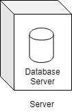

## Quick definitions

|     Type     | Database Server  |   Database Client   |
|:-------------|:-----------------|:--------------------|
|   MongoDB    | MongoDB Server   |     Robo 3T         |
|   MySQL      | MySQL Server     |     MySQL Workbench |